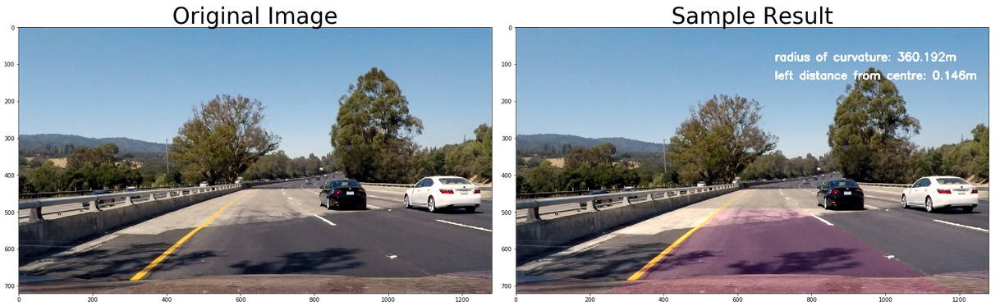
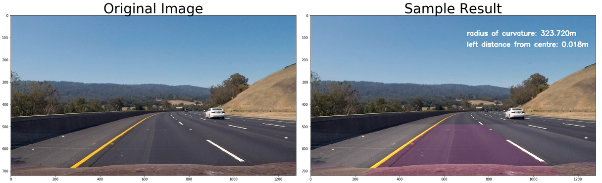

# Project: **Advanced Lane Lines** 
***
## Introduction

The purpose of this project is to find curved lane lines where more challenging road situations exist, such as presence of shadows and plenty of brightness as well as other obstacles (e.g. bridges). The pipeline developed is tried on the road from still images and a video stream.

--------
The four additional efforts are made to improve a lane line detection efficient and more robust in this project.

1. Once lanes are found with certain level of confidence in the first frame, lane lines on the next frames can be searched within the margin from the previously-found lane line pixels.

2. To adapt changes from curved lanes, the trapezoidal shapes of the four source points are found through a lane detection method with mask, Hough transformation and interpolation, rather than a manual identification.

3. To avoid jitter, the previously-found lane slopes are averaged, weighted and combined together with the current lane slopes found. This practice improved the identification of the trapezoidal shapes.

4. To avoid extremes, sanity checks on the distance between lanes and the position of lane lines are undertaken. If there is any indication of a bad detection, previous average is used instead of the current lanes found.

--------

There are 8 steps gone through to identify lane lines:

1. Create object and image points and undistort the image from this information.
2. Extract features from gradient thresholding.
3. Extract features from colour thresholding.
4. Combine the aforementioned two thresholding together.
5. Transform a persepective to make the image appearing look down from the top (i.e. bird eye view).
6. Find lane line pixels with a sliding window approach.
7. Interpolate the lane lines from the pixels.
8. Measure curvature.


## Camera Calibration

To undistort an image, finding corner and calibrating camera from a 3D to 2D image and undistorting the image with the camera matrix found from the previous steps. To do so, a chessboard image is useful because it is easy to:

* find corners of the chessboard
* map between object points (anchor) and image points (distorted positions).

This steps are outlined in the 'create_object_image_points' function.

Corners found and drawn on a chessboard


Original distorted chessboard image


Undistorted chessboard image


## Pipeline description for images

### Camera calibration and undistort images

This undistortion is applied to the view from a car below. The undistorted image looks almost similar to the original image but there is a slight difference, in particular, where you look at the car's bonnet is located.

Original distorted chessboard image


Undistorted chessboard image


### Thresholding combination of Grandients and Colours

I combined two different thredholding methods - Grandients and Coulours.

#### Extract features through gradient thresholding

The four thresholding steps are performed within this gradient thresholding.

* magnitude changes in x gradients
* magnitude changes in y gradients
* magnitude changes in both x and y gradients
* direction of gradients

The 'find_sobel' function below returns the maginitude changes of either x or y gradients.

The 'find_magnitude' function below returns both x ad y's changes in magnitudes. This function picks up the gradient differences well as seen below. When I use a sobel kernel size 19, more coarse gradient differences are returned - the lines are thicker.


When a sobel kernel size 3 is used, more refined lines are shown.


A direction of gradients can be calculated through a arctan function. This function alone does not return clear lines. In fact, it is quite noisy, but it helps to identify lines on the ground only.


All these efforts to differentiate gradients are combined through the 'combine_threshold_gradients' function, which provides the following binary image:


#### Extract features through colour thresholding

Four colour thresholdings are used: Green channel, Saturation channel, Light channel (from Luv) and B channel (from LAB for yellow lanes). I intentionally discarded using 'R' channel as it turns out that with using 'R' channel, the bright spot is recognised too much that the areas between the detected lanes are tilted too much towards the bright spot.

I am selecting test image 4 as it has a large spot for excessive brightness within the image to make a lane detection task difficult.

As seen below, the 'R' channel binary shows a large white spot towards top left.


It seems to be a little weaker, but binary green with mask seems to be a better choice when there is much light.


The 'find_hls' function seperates 'saturation' channel and it does a great job in separation lines.


'Hue' and 'Lightness' channels are noisy due to a bright area presented in the image.


Lightness of 'L' channel helps to detect scarce white lines on the right side on the test images.


'B' channel helps to clerly detect yellow lane lines as follow:


These four colour thresholdings, channel 'G', 'S', 'L' and 'B' are combined together in the 'combine_threshold_colour' function.

#### Combining gradient and colour thresholding together

In this section, gradient and colour thresholdings are combined together. The image on the left below is showing contribution from grandient thresholding in green while blue colour represents colour thresholding.


### Transform perspectives

I placed extra efforts to think about transforming perspectives. I thought that the original process of looking at each image mannually to transform perspectives can be improved. Thus, I experimented how to get the correct identification of four source points of the current lane that the car is located in, and decided to utilise what we have learnt previously.

My goal is to identify four coordinates for the current lane algorithmically. Therefore, I used the process of identifying lanes through a region-of-interest mask, Hough transformation and interpolation methods.

With this method of the trapezoidal detection, I don't really need to draw the lines manually. Visualisation shows that the process is working as intended.


This shape becomes a rectangle once it is warped - from a bird-eye view. The unwarped image is also compared below.


### Find lines from the transformed image

To find left and right lanes systematically, I will go through three steps:

* Make a histogram based on the sum of column values with standardisation and identify the two maximum points, one on the left and the other on the right side. I decided to take the whole image's histogram because in many cases, bottom half may not include any lanes due to disconnected lines.

* find lane pixels with a sliding window approach. I utilised 10 windows to be slided for each image/frame. For each window, if there are activated pixels more than 50, they are recognised as lane line pixels.


* find lines that represent the pixels so that the two lane lines are drawn smoothly and fit to the detected pixels.

As seen below, on the left side, lane pixels found confidently. However, on the right side, there is a trace of pixels on the bottom only. This is because the right side lane scarecely present in the original warped image. It is indicated that a certain form of interpolation method must be incorporated for a video stream in order to detect right side lanes reliably.


### Calculated the radius of curvature of the lane and the position of the vehicle with respect to center

Because the image does not represent the real size of the world, it is important to convert image x and y coordinates to the real world size. I have used a real dimension of y as 9m because roughly there are three dashed lines in each warped image and each dashed lane lines are apparently 3 meters long.

```
def measure_curvature(image, left_x_values, right_x_values, left_fit, right_fit):
    #estimate conversions in x and y from pixel space to meters
    y_dim = 720
    y_real = 9 #roughly there are three dashed lines in each warped image-dashed lane lines are 3 meters long each
    x_dim = 700
    x_real = 3.7
    y_per_pixel = y_real/y_dim
    x_per_pixel = x_real/x_dim
    
    #get max value of ys
    random_y = np.linspace(0, image.shape[0]-1, image.shape[0])
    y_eval = np.max(random_y)
    
    left_fit_cr = np.polyfit(random_y*y_per_pixel, left_x_values*x_per_pixel, 2)
    right_fit_cr = np.polyfit(random_y*y_per_pixel, right_x_values*x_per_pixel, 2)
    
    left_curve = ((1+(2*left_fit_cr[0]*y_eval*y_per_pixel+left_fit_cr[1])**2)**(3/2))/np.absolute(2*left_fit_cr[0])
    right_curve = ((1+(2*right_fit_cr[0]*y_eval*y_per_pixel+right_fit_cr[1])**2)**(3/2))/np.absolute(2*right_fit_cr[0])
    
    #calculate middle curvature from left and right curve
    mean_curve = (left_curve+right_curve)/2
    
    #calcuate distance 
    left_lane = left_fit[0]*y_eval**2 + left_fit[1]*y_eval + left_fit[2]
    right_lane = right_fit[0]*y_eval**2 + right_fit[1]*y_eval + right_fit[2]
    
    #car position in the image
    car_image_position = image.shape[1]/2
    
    #car position calcuated between lanes
    car_lane_position= (left_lane + right_lane)/2
    
    #how far from the centre
    distance_centre= (car_image_position - car_lane_position)* x_per_pixel
    
    return mean_curve, distance_centre
```

### Sanity checks

It is expected that the distance between lanes are decreased when the y position moves from bottom to up - in a trapezoidal shape.

There are two sanity check points that we could try.

1. The distances are reduced as y positions move from bottom to up of the image.
2. In the video frame, the current position of lanes are not too varied from the previous average positions.

```
def sanity_check(dist_list, avr_list, tops, avr_tops):
    incorrect = False
    margin_of_error = 70
    for i, each_dis in enumerate(dist_list):
        if i<len(dist_list)-1 and each_dis < dist_list[i+1]:
            incorrect = True
            return incorrect
    for j, point in enumerate(tops):
        if (point-avr_tops[j] > margin_of_error) or (point-avr_tops[j] <  - margin_of_error):
            incorrect = True
            return incorrect
    return incorrect
```

### Example of the results

The 'finding_curved_lanes_pipeline' function encompasses the step-by-step application of a lane detection approch. This pipeline is applied to each image in the test folder.




The lane areas are reliably drawn for each of original image. However, I expect the streams from the project video to be more challenging because there are many frames that require attention to shadow, brightness and greater curved areas.

---


## Pipeline description for a video

For video streams,

1) Once the lanes from the first image capture are located, the information from this process can be used to identify the next frames of the same video.

2) The trapezoidal shape identification is also averaged so that curved areas or lanes with bright spots are not sensitive towards outliers.

3) A new detection of the lanes are added to the mean of the previous lane lines with the weight to avoid jitter in a stream.

The sample result for the project video is prepared below:


---

## Limitation and opportunities to improve

To avoid a manual detection of a trapezoidal area for a warped image, using previously-learnt knowledge, that is, masking, Hough transformation, and interpolation is utilised. However, because of this automatic detection, if an area is too shadowy or bright, the trapezoidal shape becomes unusable. To mitigate this, averaging the fitted straight lines has been adopted. However, this seems to be still shaky when there exist large bright areas with a strong curved lane line.

To avoid jitter, second-order fitted lines are also adopted. This requires some degree of hyperparameter tuning such as changing the number of previously-detected lanes or source points for calculating means and experimenting with various weights for the average. Therefore, these parameters may be specific for the particular videos. Identifying an approch where the method is less sensitive on a specific training video would be a next step forward. This opporunity will be addressed soon because the next lessons are associated with applying a deep learning approach to our vision problems reducing manual assigination of hyperparameters (though there may be other hyperparameters, for example, learning rate and momentum value) to experiment with).
