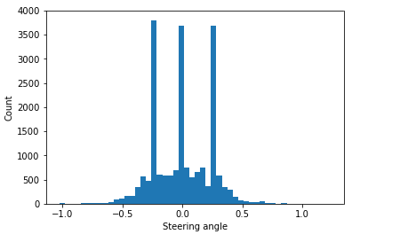
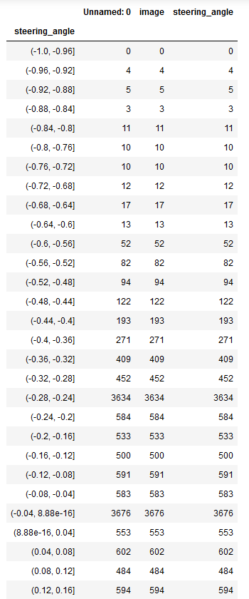
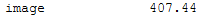
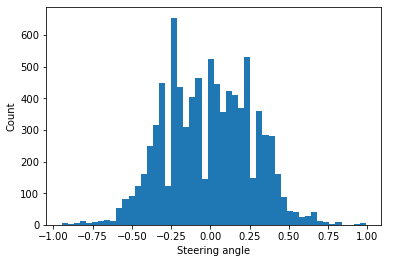
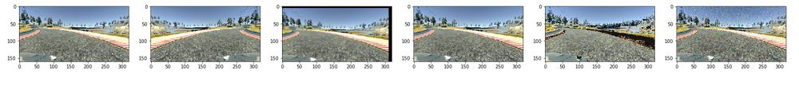
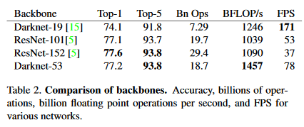
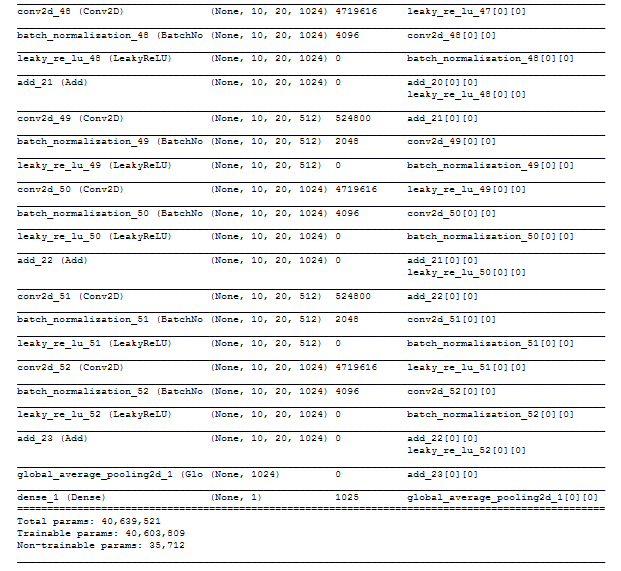

# Project: Behavioral Cloning


## Introduction
---
The purpose of this project is to enable a car to predict a series of required steering wheel angles by cloning human driver's behavior in the simulator.

The project is structured in the three stages:
* Data - Collection, exploratory data analysis, and creating data loader with Python generator
* Model - Implementing Darknet53 architecture in Keras
* Training - Experimenting to identify better hyperparameters for this dataset

----------------

While many alumni in this program implemented this project with the [NVIDIA model architecturee](https://arxiv.org/abs/1604.07316) that works fine with the dataset, I wanted to try a different architecture that is light enough as well as performs well. That is why I selected Darknet53 - the backbone of [YOLOV3](https://pjreddie.com/media/files/papers/YOLOv3.pdf). With approximately around 40 million parameters on this implementation, Darknet53 can predict the steering wheel angles with only 6-epoch training (3 training on original dataset and 3 finetuning on additional dataset).

---------------
It turns out that most important stage here is the data collection and exploratory data analysis. 

At the beginning, I trained Darknet53 with the whole sample of the data provided by Udacity. As you can see in the Exploratory Data Analysis section, this dataset is heavily imbalanced - the steering wheel angles around 0 degree dominates the dataset. Using this dataset without balancing it created the model biased towards the straight steering wheel angles, resulting in poor performance in the corners. This is explored in the data analysis section; as a result of the analysis, the dataset is then balanced with undersampling the average number of images from each interval (I used 50 intervals). 

The newly balanced dataset provides the successful performance in the first corner before the bridge. However, this does not provide sufficient generalisation because once the car passes the bridge, it goes into the dirt patch that looks like a track in a way. This is why I had to collect additional data to train further. Despite additional data, the car drove worse as it turns out that in this project, 'garbage in and garbage out' holds true. My driving skill, both in real life and in the simulator, is terrible. Since the driver drove badly, the model performed worse. It required a lot of practice to get a good enough dataset to finetune the model further. Also, I swapped using keyboard control with using mouse control - it seems that the angle data generated by mouse control is superior to those by keyboard control.

Normal track and hard track look like below:

Normal track               |  Hard track
:-------------------------:|:-------------------------:
|


## Files in this project

* data.py Class that loads a dataset and provides five different augmentation methods
* model.py Collection of Darknet 53 model architecture and training pipeline methods
* drive.py Methods to connect the trained model to predict a steering wheel angle with the simulator. Module provided by Udacity but revised to provide preprocessing of the data prior to prediction. 
* model.h5 Trained and finetuned model weights
* environments.yml Packages for Tensorflow GPU with other necessary packages (e.g. Numpy, Matplotlib, Pandas) for a conda environment

## Quick Start

### Install packages
The following line will install packages for TensorFlow GPU and other necessary packages for data preprocessing.

```
conda env create -f environment
```

### Train a new model
The following command will start to train a new Darknet53 for behavioral cloning.
The arguments for this command are:

* -d "Directory for a dataset", default value is 'data/data'.
* -f "CSV file to read in for a path for images and a list of steering angles", default value is 'resampled_log.csv'.
* -l "Learning rate", default value is 0.01.
* -e "Number of epochs", default value is 3.
* -b "Batch size", default value is 8.

For example, you can run:
```
python model.py -d "data" -f "resampled_log.csv" -l 0.01 -e 3 -b 8
```
Please note that the model does not require many epochs to train. In fact, 3 epochs are sufficient.

In addition, your file should have a column named 'image' that contains a list of path to the image files and a column named 'steering_angle' that has a list of steering wheel angles.


### Run the model to predict steering angles
First, you will need [Udacity simulator](https://github.com/udacity/self-driving-car-sim) to be installed.

Once the simulator runs, click on the "Autonomous" button then a car will appear on a track that you selected.
A car will not move until you will type the following command in your terminal.

```
python drive.py model.h5
```

Here model.h5 is the pre-trained model weights. If you created your own weight files from new training, you will have to change the file name accordingly (e.g. model_3.h5)

## Data

This section encompasses three sections:

* Data Collection - I had to collect additional data because the model started to overfit despite data augmentation.
* Exploratory Data Analysis - With this process, I could identify the problems using the whole sample dataset provided by Udacity. I created the balanced resampled dataset.
* Data Preparation - I created a DataLoader class to preprocess and split the training and validation datasets. Augmentation methods were also implemented in this class.

### Data collection

Initially, I used the sample data provided by Udacity. However, even with augmentation, this data was not sufficient for the 40-million parameters of Darknet53. I had to, therefore, collect additional data and this took a while since it was difficult to get good quality of data for the model to finetune.

I collected two-lap of the original direction on the normal track and three-lap of the reverse direction on the same track with the steering angles generated by mouse control.

### Exploratory data analysis

Additional dataset is up to 20,382 by utilising images taken from center, left and right cameras. When using left and right camera images, I had to adjust the steering angles' X axis (width) by +0.25 (left) and -0.25 (right) pixels, respectively.


When creating the histogram of 50 intervals to count how many images are in each interval, it displays a heavily-imbalanced distribution.

```
histogram = plt.hist(origin_df['steering_angle'], bins=50)
plt.xlabel("Steering angle")
plt.ylabel("Count")
plt.show(histogram)
```



As seen above, three intervals have the number of images larger than 3,500 while all other intervals has the number of images around or less than 500. In addition, there seems to be a small number of angles smaller than -1.0 and greater than 1.0. For the integrity, I removed the invalid steering angles that are less than -1.0 and larger than 1.0. 

Now, 20,372 images are left.

I wanted to look at the exact number of images for 50 intervals. To do so, I created a range of 51 points (i.e. every 0.04 step (2.0/50 intervals) -1 to 1). Then, count the images that are grouped between evert 0.04 step.



The intervals with the three largest counts have more than 3,600 images while the intervals with the small count possess 0-5 counts. The mean of the intervals are around 408 images.



To make the imbalanced dataset balanced, I used resampling, specifically undersampling the dominating number of steering angles.

```
samples = 400
resampled = pd.DataFrame()

for small_r in np.arange(-1, 1.01, 0.04):  
    part_df = origin_df.loc[(origin_df['steering_angle'] >= small_r) & (origin_df['steering_angle'] < small_r+0.04)]
    sample_n = min(samples, part_df.shape[0])
    resampled = pd.concat([resampled, part_df.sample(sample_n, random_state=1)])

resampled.to_csv('add_data/origin_dir/resampled_log.csv', index=False)
```
This generates only 8,748 images for the whole dataset and it seems much more balanced as noticed in the histogram below.



Now, it is ready to prepare data augmentation and loader so that data is ready for training.


### Data preparation

In this section, I prepared a DataLoader class to load and augment the data and split it into train and validation sets.

I split the data into the training and validation set - I used 10% for the validation dataset since this is the additional finetuning data. There are 7,873 images used for the training set while 875 images are reserved for the validation set. It seems to be a small dataset, however, with random data augmentation, the trainng set will be increased to 39,365.

There are five data augmentation methods adopted for this project:

1. flip horizontally
2. shift along x and y axis
3. blur
4. adjust brightness
5. add noise on pixels



In addition, a batch generator method using Python Generator is prepared to save memory and feed the data to the model smoothly.

```
def generate_batch(X, y, bs, data):
    len_X = len(X)
    #for generator, a continuous loop
    while True:
        X, y = shuffle(X, y)
        epo = 0
        #batch generator
        for offset in range(0, len_X*5, bs):
            while offset>=len_X:
                offset -= len_X
            #take a batch
            batch_X, batch_y = X[offset:offset+bs], y[offset:offset+bs]
            #augment the dataset to increase and transform images
            batch_X, batch_y = data.augment_data(batch_X, batch_y)
            
            images = []
            s_angles = []
            for i in range(len(batch_X)):
                images.append(batch_X[i])
                s_angles.append(batch_y[i])
                
            X_batch = np.array(images)
            y_batch = np.array(s_angles)
             
            yield X_batch, y_batch
```

## Model

As mentioned earlier, I decided to use Darknet53, the backbone of YoloV3, for a steering angle prediction. 

Darknet53 performs well utilising Resnet layers with a relatively smaller number of billions of operations and billion floating operations per second (please see the comparison table below from [YOLOv3 paper](https://pjreddie.com/media/files/papers/YOLOv3.pdf). This is one of the reason why YoloV3 is able to produce a real-time prediction on embedded devices.

I believe that an efficient operation without sacrificing performance is crucial to computer vision components supporting self driving car engineering.



I replaced the last fully connected layer, which has 1000 classes (for Imagenet dataset), and the softmax layer with only one-output fully connected layer so that the whole model can provide a single number that indicates a steering angle. Therefore, this architecture is for a regression problem, instead of a classification problem.

```
def darknet53(sinput:Collection[int], num_blocks:Collection[int], output_sz:int=32):
    input_shape = Input(shape=sinput)
    x = Lambda(lambda x: x/255.0-0.5, input_shape=sinput)(input_shape)
    
    #dbl in 3 channels, out 32 channels
    x = dbl(x, output_sz, 3, 1)

    #first - one dbl one res units - in 32 channels, out 64 channels
    x = dbl(x, output_sz*2, 3, 1)
    x = res_unit_block(x, output_sz*2, num_blocks[0])

    #second - one dbl two res units - in 64 ch, out 128 ch
    x = dbl(x, output_sz*4, 3, 2)
    x = res_unit_block(x, output_sz*4, num_blocks[1])

    #third - one dbl eight res units - in 128 ch, out 256 ch
    x = dbl(x, output_sz*8, 3, 2)
    x = res_unit_block(x, output_sz*8, num_blocks[2])

    #four - one dbl eight res units - in 256 ch, out 512 ch
    x = dbl(x, output_sz*16, 3, 2)
    x = res_unit_block(x, output_sz*16, num_blocks[3])

    #five - one dbl four res units - in 512 ch, out 1024 ch
    x = dbl(x, output_sz*32, 3, 2)
    x = res_unit_block(x, output_sz*32, num_blocks[4])

    x = GlobalAveragePooling2D()(x)
    x = Dense(units=1)(x)

    model = Model(inputs=input_shape, outputs=x)

    return model
```

The model will take the input size of 90 Height, 320 Width and 3 Channel (BGR from CV2) - the sky and the front of the car can be distracting factors in the images. That is why the original height of 160 is cropped to 90 pixels by removing the distracting pixels. There are five blocks that have different number of layers: 1, 2, 8, 8, 4, respectively. I created a model with these configurations.


It is important to investigate the model architecture to ensure the correct configuration. In my case, I found Lambda layer was missing, by looking at the architecture. Part of the architecture is displayed below.



The model has 40 millions of parameters and 52 sets of convolutional 2D layers + batch normalisation + leaky relu layers in addition to one last fully-connected layers.


## Training

In the pipeline, I incorporated two callbacks - saving the best weights and early stopping callbacks.

```
def training_pipeline(data, model, learning_rate, filepath, bs, epoch):
    save_best = ModelCheckpoint(filepath, monitor='val_loss', verbose=0, save_best_only=True, 
                    save_weights_only=False, mode='min', period=1)
    early_stopping = EarlyStopping(monitor='val_loss', min_delta=0.005, patience=2, verbose=0, 
                                   mode='min', baseline=None, restore_best_weights=False)
    
    model.compile(loss='mean_squared_error', optimizer=Adam(lr=learning_rate))
    step_train = len(X_train)*5//bs+1
    step_valid = len(X_valid)*5//bs+1
    
    #https://keras.io/models/sequential/
    model.fit_generator(generate_batch(X_train, y_train, bs, data), steps_per_epoch=step_train, epochs=epoch, verbose=1, callbacks=[save_best, early_stopping], 
                        validation_data=generate_batch(X_valid, y_valid, bs, data), validation_steps=step_valid, 
                        class_weight=None, max_queue_size=10, workers=0, use_multiprocessing=False, shuffle=True, initial_epoch=0)
```

I need to define certain hyperparameters here, Learning rate, the number of Epoch and Batch size. 

With a number of experiment, I found that Learning rate of 0.01 for a start is OK and Batch size of 8 is maximum I can pass on with my local environment. In addition, 1 Epoch is sufficient with Learning rate of 0.01. Then, a learning rate decay is applied for subsequent epochs.


## Result

The trained model drove well until passing the bridge on the normal track. However, the car failed to follow the track right after the bridge because it went into an appealing dirt path that resembles the track.

This is why I finetuned the model with 3 additional epochs to generalise better. The final result for the normal track is below:


