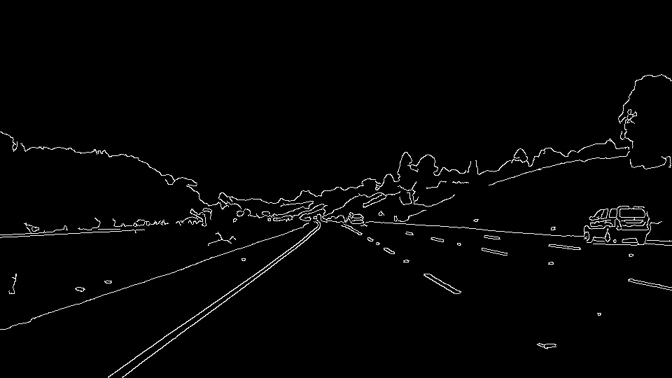

# Project: **Finding Lane Lines on the Road** 

---

## Introduction

The purpose of this project is to find lane lines on the road from still images and video streams.

First, I addressed a lane detection on a sample of still image step by step. 

Second, a lane detection on a collection of images is tested and outputs is saved as part of this exercise.

Thrid, a lane detection on video streams is tested. Straight lanes are detected and localised reasonably, but there are some issues associated with curved lanes that are not addressed correctly. This curved lane detection is addressed as part of the second project.

---

## 1. Summary of Pipeline

The pipeline implemented involves:

1. Detecting edges through gray colour transformation, noise reduction and Canny edge detection;
2. Confinening region of interests through masking areas that are not of interests;
3. Connecting pixels and edges into lines through Hough transformation technique with voting mechanisms;
4. Interpolating lines detected by Hough transformation so that lines are connected between rather than segmented; and
5. Visualising lines that are connected through interpolation.

---

### Detect edges

Initailly, edges are detected by:

* making an image into a gray-coloured image;
* reducing pixel noises through Gaussian Blur; and
* detecting all edges within an image by using Canny edge detection mechanism through identifying changes in gradients.

The result of this step provides all the edges drawn on a black background below.

---

### Confine region of interests

We do not require all sceneries from the image. Therefore, region of interests has to be defined.
To do so, I

* created a mask background from the size of an image and make all pixels black (i.e. rgb 0).
* got the size of an image and define vertices of region of interests.
* defined areas that are not to be masked (i.e. region of interest) are coloured white (255).
* filled an area bounded by not-to-be-masked with the value of 1 (i.e. white areas to have the value of 1).
* tried "AND" operations on detected edges from the previous step and current not-to-be-masked to find an area where both pixel values are 1.

This operation gives only edges within the region of interests.

![Masked edges][image2]: ./test_images_steps/masked_edges.jpg "Masked edges"

---

### Connect edges

It is time to connect the detected edges and pixels around them. We are going to use a voting system through Hough transformation. In this step, many experiments are undertaking to decide parameters such as Rho (Distance), Theta (Angle), minimum number of pixels making up a line, maximum gap in pixels between connectable line segments, and minimum number of votes.

The result image connects edges reasonably well. However, as you can see the image below, the large gaps between edges are not connected.

![Hough lines][image3]: ./test_images_steps/hough_edges.jpg "Hough lines"

For these types of issues, I am interpolating a line with a slope and an intercept so that the connection is drawn along this calculated line.

---
### Interpolate lines

This is where I attempted to improve the previous pipeline. 

To display connected lines instead of segmented lane lines with a large gap, an interpolation between lines is attempted. Slopes and intercepts are calculated through np.polyfit() with a first order. This means the interpolated line is a straight line between coordinates.

The process of interpolating coordinates is as follow:

* Calculate slopes and intercepts;
* Divide slopes based on their sign (positive and negative) into left and right lanes;
* In case of multiple slopes for the lines gone through Hough transformation, get the median of left and right slopes and intercepts; and
* Calculate x and y coordinates based on these resulting slopes and intercepts.

The output of this process provides a smooth connected lane on the left and right side below:

![Connected lines][image4]: ./test_images_steps/connected_edges.jpg "Connected lines"

---
### Draw lines

Finally, the interpolated lanes are drawn on the image with np.line() function with Magenta colour and a thickness of 5.

The final output image is:

![Drawn lines][image5]: ./test_images_steps/solidYellowCurve.jpg "Output image"

---

These five steps are then repeated on test images and video stream. The outputs are located in:

~/test_images_output/
~/test_videos_output/

## 2. What worked and what did not work so well

Overall, the pipeline performs reasonably on the testing images and videos. However, the current testing set tends to have straight lanes that possess relatively clear white or yellow colours.

Examining the outputs of tested images and vidoes, the first disadvantage I found was caused from a colour. I noticed that if the background images has a saturated colour close to white within the region of interests, the lanes can be quite shaky and confused.

I also tested my pipeline on the challenge video stream and it performed terribly. Not only it cannot pick up some lanes, but also it connects between coordinates from left lanes and those from right lanes. In addition, this pipeline does not work for curved section of the lanes.

I experimented around my method in interpolating lines and found that some column and row coordinates are provided with unreliable numbers (e.g. coordinate values are larger than maximum column and row sizes of the image). I believe this caused from the combination of the masking method that uses hard-coded polygonal region of interests and the interpolating method that only uses first order polyfit mechanism.

## 3. Opportunities to improve

The potential solution to a colouring and detection problem would be replacing hard coded edge detection and masking with adpative learning methods such as lane detection through Deep Neural Networks (e.g. [Robust Lane Detection from Continuous Driving Scenes Using Deep Neural Networks](https://arxiv.org/abs/1903.02193). These methods would also be useful in identifying lanes without visible or clear lane markings on road.

The possible solution to a terrible performance on curved lanes would require polyfitting on a higher degree of order. As the interpolation method is based on the first order, adopting curved lines to fit coordinates would provide a better lane detection mechanism.
