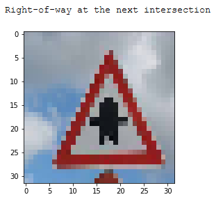

# Traffic Sign Classifer with Resnet-like and Squeeze-and-Excitation-like blocks


Overview
---
The purpose of this project is to create an end-to-end process of classifying [German traffic sign images](http://benchmark.ini.rub.de/?section=gtsrb&subsection=dataset). The complete process includes:
 1. Preparation for data
 2. Exploratory data analysis
 3. Data processing and augmentation
 4. Building a model archtecture for classification
 5. Deciding a loss function, metric(s), and other hyperparameters such as learning rate
 6. Training the model
 7. Analysing the results from the trained model on a new dataset
 
 --------------
 
To undertake this project, I particularly focused on **enhancing performance by creating a model architecture with tensorflow based on Resnet blocks (https://arxiv.org/abs/1512.03385) and Squeeze and Excitation blocks (https://arxiv.org/abs/1709.01507)**.

In addition, I incorporated mitigation measures for overfitting issues through **adopting data augmentation**, such as rotation, horizontal flip, gaussian blur and adding noise, **incorporating cross validation sets** as well as **placing batch normalisation layers** in the model architecture.

This project is strucutured with the four large segments as follow:

* Data - this section includes preparataion of importing and formatting data, exploratory data analysis, and data processing and augmentation prior to training.
* Model architecture - this segment focuses on building an tailored arthitecture for the project. Two convolutional blocks, Resnet blocks and Squeeze and Excitation blocks (SE blocks), are built in the architecture.
* Training - this segment provides explanations and codes around loss function, metrics and training hyperparameters and how they are built in the TrainingPipeline class.
* Result Analysis - this section outlines the results of validation sets and new test dataset. In addition, testing on newly-downloaded datasets is undertaken in this section.


## Data

### Set up for data

To import the datasets composed of train, validation and test sets, I write the define_dataset function to import and do an integrity check.

```
def define_dataset(path_to_data):
    #define filename for each set
    training_file = os.path.join(path_to_data, "train.p")
    validation_file= os.path.join(path_to_data, "valid.p")
    testing_file = os.path.join(path_to_data, "test.p")

    with open(training_file, mode='rb') as f:
        train = pickle.load(f)
    with open(validation_file, mode='rb') as f:
        valid = pickle.load(f)
    with open(testing_file, mode='rb') as f:
        test = pickle.load(f)

    X_train, y_train = train['features'], train['labels']
    X_valid, y_valid = valid['features'], valid['labels']
    X_test, y_test = test['features'], test['labels']
    
    #integrity check
    assert len(X_train)==len(y_train)
    assert len(X_valid)==len(y_valid)
    assert len(X_test)==len(y_test)
    return X_train, y_train, X_valid, y_valid, X_test, y_test

```

My intention is to use cross-validation datasets so I combine train and validation datasets into one for both features and labels so that I can split them into k cross-validation sets later.

```
X_train_valid = np.concatenate((X_train, X_valid), axis=0)
```

When combined together, the training and validation dataset is 39,209.


There are 43 classes/labels avaliable. This 'n_classes' variable will indicate this size, which will be useful throughout the project.


### Exploratory Data Analysis

#### Description and distribution of the dataset

Looking at the first five row and last five row of the data below, the dataset is arranged/grouped by its label. Therefore, shuffling the dataset is required before training; otherwise, with the batch processing class by class will be learnt, which is not desirable when testing with a validation set. 


I would like to understand how the examples are distributed - are we dealing with a balanced dataset?


As it can be seen above, the dataset seems to be heavily imbalanced ranged from 210 to 2250 images per label.

The maximum examples are for label 2, "Speed limit (50km/h)", which has 2250 images and labels are available. The minimum examples, 210 images, are for lable 0, 19 and 37, "Speed limit (20km/h)", "Dangerous curve to the left" and "Go straight or left".

#### Data visualisation

To visualise the data, I am using the plot_samples_per_label method to display a sample of images per label.

```
def plot_samples_per_label():
    for i in range(len(class_df)):
        print(f"Class: {class_df['ClassId'].iloc[i]}, {class_df['SignName'].iloc[i]}")
        f = plt.figure(figsize = (15, 1))
        plt.subplots_adjust(left=0., right=1, top=0.9, bottom=0.)
        random_samples = random.sample(range(class_start[i], class_start[i] + count[i]), 10)
        for j in range(10):
            ax = f.add_subplot(1, 10, j+1, xticks=[], yticks=[])
            ax.imshow(X_train_valid[random_samples[j]])
        plt.show()
```


Some images seem to have really bad quality. For instance, the second left example from Class 26, Traffic signals is not noticible because of its darkness.


Also, some labels for the examples are not correct. For example, the sixth example from Class 8, Speed limit is labelled incorrectly - this image seems to belong to Class 10, No passing for vehicles over 3.5 metric tones. The second last example from Class 14, Stop seems to belong to Class 15, No vehicles.


Because the images include different levels of brightness, I will focus on data augmentation methods that are more related to phyical transforms such as rotation and horizontal flip. Also, adding noise and blur are adopted for data augmentation.


### Data processing

Next step is to make cross validation datasets. Cross validation is a useful method when using a limited dataset. If I generate 5 cross-validation datasets, a sample will be used 4 times in training sets and 1 time in a validation set. To utilise the number of images available more efficiently, I created 4 train and validation sets below with the Dataset class.

```
class Dataset():
    def __init__(self, X, y, k):
        self.X = X
        self.y = y
        self.k_fold = k
        self.X_train_set = []
        self.y_train_set = []
        self.X_valid_set = []
        self.y_valid_set = []
    
    def cross_validation(self):
        skf = StratifiedKFold(n_splits=self.k_fold, random_state=True, shuffle=True)
        skf.get_n_splits(self.X, self.y)
        for train_index, valid_index in skf.split(self.X, self.y):
            X_train, X_valid = self.X[train_index], self.X[valid_index]
            y_train, y_valid = self.y[train_index], self.y[valid_index]
            assert len(X_train)==len(y_train)
            assert len(X_valid)==len(y_valid)
            self.X_train_set.append(X_train)
            self.y_train_set.append(y_train)
            self.X_valid_set.append(X_valid)
            self.y_valid_set.append(y_valid)
        return  self.X_train_set, self.X_valid_set, self.y_train_set, self.y_valid_set
```
Then, I normalise the dataset and prepare train and validation sets before training.

```
def normalise(X):
    epsilon = 1e-06
    X_trans = X/255 + epsilon
    return X_trans
```

After creating cross-validation sets, the number of examples in the train and validation set are 31,367 and 7,842, respectively.

### Data Augmentation

As discussed in the data visualisation section before, four data agumentation methods are used: rotation, horizontal flip, adding noise and blurring images. To display the effect of each method, I will use the display_image method to provide the original image on the left and the transformed image on the right.

I created a simple ImageAugmentation class to augment the images.

```
class ImageAugmentation:
    def __init__(self, bs):
        self.bs = bs
        
    def augmentation(self, X, y):
        if len(X)!=0:
            X_augmented = []
            for i in range(len(X)):
                rand_prob = random.random()
                X_copy = X[i]
                if rand_prob > 0.4:
                    pass
                else:
                    rand_transform = random.randrange(4)
                    if rand_transform==0:
                        X_copy = self.rotate(X_copy, 50)
                    if rand_transform==1:
                        X_copy = self.add_noise(X_copy)
                    if rand_transform==2:
                        if y[i] not in [33, 34, 36, 37, 38, 39]:
                            X_copy = self.flip_horizontal(X_copy)
                    if rand_transform==3:
                        X_copy = self.blur(X_copy)
                X_augmented.append(X_copy)
        return X_augmented, y
    
    def rotate(self, X, degree):
        random_degree = random.uniform(-1*degree, degree)
        image = sk.transform.rotate(X, random_degree) 
        return image
    
    def add_noise(self, X):
        image = sk.util.random_noise(X, mode='gaussian')
        return image
    
    def flip_horizontal(self, X):
        image = X[:, ::-1]
        return image
    
    def blur(self, X):
        random_int = random.randrange(4)
        image = sk.filters.gaussian(X, random_int, multichannel=True, mode='reflect')
        return image
```

The augmented images are compared below:


With a random probability, some images are left as original while other images can be transformed with one of the four augmentation methods discussed above. I experimented with a greater extent of augmentation methods and it did not turn out well. I suspect this is because the original images are not of good quality and the size of images are only 32 by 32 that a greater degree augmentation may distort this small extent of the existing information heavily.

Data preparation is done. It is time to think about what architecutre I would use for classifying the transformed dataset!

## Model Architecture

The model for classifying traffic signs incorporstes Resnet-like and SE-like blocks within the architecture. The characteristics of the architecture is as follow:

1. There are four resnet blocks and three SE blocks.

2. Input data is filtered through one convolutional layer first.

3. Each resnet block has two convolutional layer, batch normalisation layer, and relu activation. At the end of each resnet block, identify conv layer and the output of two resnet blocks are added.

4. Following every resnet block except for the last resnet block, SE block contians average pooling, convolutional layer, relu activation, convolutional layer, relu, sigmoid and concatenation of the previous output and the output from the resnet block. Finally, the output of this concatenation is combined together with the identity conv layer.

The overarching model architecture is described in a diagram below.


The model architecutre is built with Tensorflow from scratch.

```
def ResNet_SE_like(x):
    mu = 0
    sigma = 0.1
    #reduction rate for SE blocks
    reduction = 16
    #weight initialiser and regularizer (l2) for conv layers in SE blocks
    weight_init = tf.contrib.layers.variance_scaling_initializer()
    weight_regularizer = tf.contrib.layers.l2_regularizer(1e-04)
    
    #new_height = (input_height - filter_height + 2 * P)/S + 1
    #new_width = (input_width - filter_width + 2 * P)/S + 1
    
    #resnet block 1_0 - conv, batch norm, relu - 16 channels
    with tf.variable_scope('weight10', reuse=tf.AUTO_REUSE):
        conv1_W0 = tf.get_variable("weight10", shape=(3, 3, 3, 16), initializer=tf.contrib.layers.xavier_initializer())
    with tf.variable_scope('bias10', reuse=tf.AUTO_REUSE):
        conv1_b0 = tf.get_variable("bias10", shape=(16), initializer=tf.contrib.layers.xavier_initializer())
    conv1   = tf.nn.conv2d(x, conv1_W0, strides=[1, 1, 1, 1], padding='SAME') + conv1_b0
    
    residual = conv1
    
    with tf.variable_scope('bn10', reuse=tf.AUTO_REUSE):
        conv1 = tf.layers.batch_normalization(conv1, momentum=0.99, epsilon=1e-03, center=True, 
                                          scale=True, training=True, name='bn10')
    conv1 = tf.nn.relu(conv1)

    #resnet block 1_1 - conv, batch norm, relu - 16 channels
    with tf.variable_scope('weight11', reuse=tf.AUTO_REUSE):
        conv1_W1 = tf.get_variable("weight11", shape=(3, 3, 16, 16), initializer=tf.contrib.layers.xavier_initializer())
    with tf.variable_scope('bias11', reuse=tf.AUTO_REUSE):
        conv1_b1 = tf.get_variable("bias11", shape=(16), initializer=tf.contrib.layers.xavier_initializer())
    conv1  = tf.nn.conv2d(conv1, conv1_W1, strides=[1, 1, 1, 1], padding='SAME') + conv1_b1
    
    with tf.variable_scope('bn11', reuse=tf.AUTO_REUSE):
        conv1 = tf.layers.batch_normalization(conv1, momentum=0.99, epsilon=1e-03, center=True, 
                                          scale=True, training=True, name='bn11')
    conv1 = conv1 + residual
    out = tf.nn.relu(conv1)
    
    #se block 1 - squueze to 1 channel back to 16 channel
    conv1 = tf.nn.avg_pool(out, [1, 1, 1, 1], [1, 1, 1, 1], 'SAME', data_format="NHWC")

    conv1 = tf.layers.conv2d(inputs=conv1, filters=16//reduction,
                         kernel_size=1, kernel_initializer=weight_init,
                             kernel_regularizer=weight_regularizer,
                         strides=1, use_bias=False, padding='SAME')
    conv1 = tf.nn.relu(conv1)
    conv1 = tf.layers.conv2d(inputs=conv1, filters=16,
                         kernel_size=1, kernel_initializer=weight_init,
                             kernel_regularizer=weight_regularizer,
                         strides=1, use_bias=False, padding='SAME')
    conv1 = tf.nn.relu(conv1)
    conv1 = tf.nn.sigmoid(conv1)
    conv1 = conv1*out
    conv1 = conv1+residual

    #resnet block 2_0 - 64 channels
    with tf.variable_scope('weight20', reuse=tf.AUTO_REUSE):
        conv2_W0 = tf.get_variable("weight20", shape=(3, 3, 16, 64), initializer=tf.contrib.layers.xavier_initializer())
    with tf.variable_scope('bias20', reuse=tf.AUTO_REUSE):
        conv2_b0 = tf.get_variable("bias20", shape=(64), initializer=tf.contrib.layers.xavier_initializer())
    conv2   = tf.nn.conv2d(conv1, conv2_W0, strides=[1, 1, 1, 1], padding='SAME') + conv2_b0

    residual = conv2
    
    with tf.variable_scope('bn20', reuse=tf.AUTO_REUSE):
        conv2 = tf.layers.batch_normalization(conv2, momentum=0.99, epsilon=1e-03, center=True, 
                                          scale=True, training=True, name='bn20')
    conv2 = tf.nn.relu(conv2)

    #resnet block 2_1 - 64 channel
    with tf.variable_scope('weight21', reuse=tf.AUTO_REUSE):
        conv2_W1 = tf.get_variable("weight21", shape=(3, 3, 64, 64), initializer=tf.contrib.layers.xavier_initializer())
    with tf.variable_scope('bias21', reuse=tf.AUTO_REUSE):
        conv2_b1 = tf.get_variable("bias21", shape=(64), initializer=tf.contrib.layers.xavier_initializer())
    conv2   = tf.nn.conv2d(conv2, conv2_W1, strides=[1, 1, 1, 1], padding='SAME') + conv2_b1
    
    with tf.variable_scope('bn21', reuse=tf.AUTO_REUSE):
        conv2 = tf.layers.batch_normalization(conv2, momentum=0.99, epsilon=1e-03, center=True, 
                                          scale=True, training=True, name='bn21')
    conv2 = conv2 + residual
    out = tf.nn.relu(conv2)
    
    #se block 2 - squeeze into 4 channels and back to 64 channels
    conv2 = tf.nn.avg_pool(out, [1, 1, 1, 1], [1, 1, 1, 1], 'SAME', data_format="NHWC")

    conv2 = tf.layers.conv2d(inputs=conv2, filters=64//reduction,
                         kernel_size=1, kernel_initializer=weight_init,
                             kernel_regularizer=weight_regularizer,
                         strides=1, use_bias=False, padding='SAME')
    conv2 = tf.nn.relu(conv2)
    conv2 = tf.layers.conv2d(inputs=conv2, filters=64,
                         kernel_size=1, kernel_initializer=weight_init,
                             kernel_regularizer=weight_regularizer,
                         strides=1, use_bias=False, padding='SAME')
    conv2 = tf.nn.relu(conv2)
    conv2 = tf.nn.sigmoid(conv2)
    conv2 = conv2*out
    conv2 = conv2+residual

    #resent block 3_0 - 128 channels
    with tf.variable_scope('weight30', reuse=tf.AUTO_REUSE):
        conv3_W0 = tf.get_variable("weight30", shape=(3, 3, 64, 128), initializer=tf.contrib.layers.xavier_initializer())
    with tf.variable_scope('bias30', reuse=tf.AUTO_REUSE):
        conv3_b0 = tf.get_variable("bias30", shape=(128), initializer=tf.contrib.layers.xavier_initializer())
    conv3   = tf.nn.conv2d(conv2, conv3_W0, strides=[1, 1, 1, 1], padding='SAME') + conv3_b0
    
    residual = conv3
    with tf.variable_scope('bn30', reuse=tf.AUTO_REUSE):
        conv3 = tf.layers.batch_normalization(conv3, momentum=0.99, epsilon=1e-03, center=True, 
                                          scale=True, training=True, name='bn30')
    conv3 = tf.nn.relu(conv3)

    #resnet block 3_1 - 128 channels
    with tf.variable_scope('weight31', reuse=tf.AUTO_REUSE):
        conv3_W1 = tf.get_variable("weight31", shape=(3, 3, 128, 128), initializer=tf.contrib.layers.xavier_initializer())
    with tf.variable_scope('bias31', reuse=tf.AUTO_REUSE):
        conv3_b1 = tf.get_variable("bias31", shape=(128), initializer=tf.contrib.layers.xavier_initializer())
    conv3   = tf.nn.conv2d(conv3, conv3_W1, strides=[1, 1, 1, 1], padding='SAME') + conv3_b1
    
    with tf.variable_scope('bn31', reuse=tf.AUTO_REUSE):
        conv3 = tf.layers.batch_normalization(conv3, momentum=0.99, epsilon=1e-03, center=True, 
                                          scale=True, training=True, name='bn31')
    conv3 = conv3 + residual
    out = tf.nn.relu(conv3)
    
    #se block 3 - squeeze into 8 channels and back to 128 channels
    conv3 = tf.nn.avg_pool(out, [1, 1, 1, 1], [1, 1, 1, 1], 'SAME', data_format="NHWC")

    conv3 = tf.layers.conv2d(inputs=conv3, filters=128//reduction,
                         kernel_size=1, kernel_initializer=weight_init,
                             kernel_regularizer=weight_regularizer,
                         strides=1, use_bias=False, padding='SAME')
    conv3 = tf.nn.relu(conv3)
    conv3 = tf.layers.conv2d(inputs=conv3, filters=128,
                         kernel_size=1, kernel_initializer=weight_init,
                             kernel_regularizer=weight_regularizer,
                         strides=1, use_bias=False, padding='SAME')
    conv3 = tf.nn.relu(conv3)
    conv3 = tf.nn.sigmoid(conv3)
    conv3 = conv3*out
    conv3 = conv3+residual
    
    #resnet block 4_0 - 256 channels
    with tf.variable_scope('weight40', reuse=tf.AUTO_REUSE):
        conv4_W0 = tf.get_variable("weight40", shape=(3, 3, 128, 256), initializer=tf.contrib.layers.xavier_initializer())
    with tf.variable_scope('bias40', reuse=tf.AUTO_REUSE):
        conv4_b0 = tf.get_variable("bias40", shape=(256), initializer=tf.contrib.layers.xavier_initializer())
    conv4   = tf.nn.conv2d(conv3, conv4_W0, strides=[1, 1, 1, 1], padding='SAME') + conv4_b0

    residual = conv4
    with tf.variable_scope('bn40', reuse=tf.AUTO_REUSE):
        conv4 = tf.layers.batch_normalization(conv4, momentum=0.99, epsilon=1e-03, center=True, 
                                          scale=True, training=True, name='bn40')
    conv4 = tf.nn.relu(conv4)

    #resnet block 4_1 - 256 channels
    with tf.variable_scope('weight41', reuse=tf.AUTO_REUSE):
        conv4_W1 = tf.get_variable("weight41", shape=(3, 3, 256, 256), initializer=tf.contrib.layers.xavier_initializer())
    with tf.variable_scope('bias41', reuse=tf.AUTO_REUSE):
        conv4_b1 = tf.get_variable("bias41", shape=(256), initializer=tf.contrib.layers.xavier_initializer())
    conv4   = tf.nn.conv2d(conv4, conv4_W1, strides=[1, 1, 1, 1], padding='SAME') + conv4_b1
    
    with tf.variable_scope('bn41', reuse=tf.AUTO_REUSE):
        conv4 = tf.layers.batch_normalization(conv4, momentum=0.99, epsilon=1e-03, center=True, 
                                          scale=True, training=True, name='bn41')
    conv4 = conv4 + residual
    conv4 = tf.nn.relu(conv4)
    

    #global average pooling for fully-connected layer - pooling across 32x32
    conv4 = tf.reduce_mean(conv4, axis=[1, 2])
    
    #flatten the tensor
    fc0   = flatten(conv4)
    
    #first fully-connected layer
    shape_flatten = int(fc0.shape[1])
    with tf.variable_scope('fc1w', reuse=tf.AUTO_REUSE):
        fc1_W = tf.Variable(tf.truncated_normal(shape=(shape_flatten, 120), mean = mu, stddev = sigma, name="fc1w"))
    with tf.variable_scope('fc1b', reuse=tf.AUTO_REUSE):
        fc1_b = tf.Variable(tf.zeros(120), name="fc1b")
    fc1   = tf.matmul(fc0, fc1_W) + fc1_b
    fc1    = tf.nn.relu(fc1)

    #second fully-connected layer
    with tf.variable_scope('fc2w', reuse=tf.AUTO_REUSE):
        fc2_W  = tf.Variable(tf.truncated_normal(shape=(120, 84), mean = mu, stddev = sigma, name="fc2w"))
    with tf.variable_scope('fc2b', reuse=tf.AUTO_REUSE):
        fc2_b  = tf.Variable(tf.zeros(84), name="fc2b")
    fc2    = tf.matmul(fc1, fc2_W) + fc2_b
    fc2    = tf.nn.relu(fc2)

    #third fully-connectd layer with the number of classes output
    with tf.variable_scope('fc3w', reuse=tf.AUTO_REUSE):
        fc3_W  = tf.Variable(tf.truncated_normal(shape=(84, 43), mean = mu, stddev = sigma, name="fc3w"))
    with tf.variable_scope('fc3b', reuse=tf.AUTO_REUSE):
        fc3_b  = tf.Variable(tf.zeros(43), name="fc3b")
    logits = tf.matmul(fc2, fc3_W) + fc3_b
    
    return logits
```

The following reference github projects were helpful in creating this model.

* https://github.com/taki0112/ResNet-Tensorflow
* https://github.com/Cadene/pretrained-models.pytorch/blob/master/pretrainedmodels/models/senet.py

I intentionally included three SE blocks instead of four because the accuracy was better with the three blocks.

Now we have the data and the model architecture prepared, it is time to create a pipeline function and train the model.


## Training Pipeline

To train on the dataset, a number of hyperparameters had to be decided. These includes epoch, batch size, learning rate, loss function, optimiser and metric:

* Epoch = Starting from 19 epoch and reduced as training progresses.
* Batch size = 256
* Learning rate = Learning rate decay is adopted, ranged from 0.01 to 0.01/(2^5), based on the result from experiments.
* Loss function = Cross entorpy
* Optimiser = Adam optimiser
* Metric = Accuracy

```
class TrainPipeline:
    def __init__(self, epoch, bs, X_train, y_train, X_valid, y_valid, X_test, y_test, num_classes):
        self.epoch = epoch
        self.bs = bs
        self.X_train = X_train
        self.y_train_set = y_train
        self.X_valid = X_valid
        self.y_valid_set = y_valid
        self.X_test = X_test
        self.y_test = y_test
        self.n_classes = num_classes
        
    def initialise_input(self, num_classes):
        self.x = tf.placeholder(tf.float32, (None, 32, 32, 3))
        self.y = tf.placeholder(tf.int32, (None))
        self.one_hot_y = tf.one_hot(self.y, num_classes)
        self.learning_rate = tf.placeholder(tf.float32, shape=[])
        
    def create_model(self):
        self.logits = ResNet_SE_like(self.x)
    
    def define_lossf(self):
        self.cross_entropy = tf.nn.softmax_cross_entropy_with_logits(labels=self.one_hot_y, logits=self.logits)
        self.loss_operation = tf.reduce_mean(self.cross_entropy)
        self.optimizer = tf.train.AdamOptimizer(learning_rate = self.learning_rate).minimize(self.loss_operation)
    
    def define_metric(self):
        self.correct_prediction = tf.equal(tf.argmax(self.logits, 1), tf.argmax(self.one_hot_y, 1))
        self.accuracy_operation = tf.reduce_mean(tf.cast(self.correct_prediction, tf.float32))
        self.saver = tf.train.Saver()
        
    def evaluate(self, X_data, y_data):
        num_examples = len(X_data)
        total_accuracy = 0
        sess = tf.get_default_session()
        for offset in range(0, num_examples, self.bs):
            batch_x, batch_y = X_data[offset:offset+self.bs], y_data[offset:offset+self.bs]
            accuracy = sess.run(self.accuracy_operation, feed_dict={self.x: batch_x, self.y: batch_y})
            total_accuracy += (accuracy * len(batch_x))
        return total_accuracy / num_examples
        
    def prep_train(self):
        self.initialise_input(self.n_classes)
        self.create_model()
        self.define_lossf()
        self.define_metric()
        
    def train(self, learning_rate):
        self.prep_train()
        aug = ImageAugmentation(self.bs)
        with tf.Session() as sess:
            sess.run(tf.global_variables_initializer())
            #number of cross validation data sets - 2
            num_cross = len(self.X_train)
            #number of examples in each train data set
            num_examples = len(self.X_train[0])
            for i in range(num_cross):
                print("Training cross validation {}".format(str(i)))
                print()
                X_train_c, y_train_c = shuffle(self.X_train[i], self.y_train_set[i])
                lr = learning_rate
                lr /= np.power(1.8, i)
                #learning rate decay and epoch reduction
                if i==0:
                    epoch = self.epoch//5 + 9
                elif i==1:
                    epoch = 7
                else:
                    epoch = self.epoch//10
                    
                print("Learning rate: {}".format(str(lr)))
                
                for j in range(epoch):
                    total_accuracy = 0
                    #feed images with batch size, in this case 256 images each time
                    for offset in range(0, num_examples, self.bs):
                        end = offset + self.bs
                        batch_x, batch_y = X_train_c[offset:end], y_train_c[offset:end]
                        batch_x, batch_y = aug.augmentation(batch_x, batch_y)
                        sess.run(self.optimizer, feed_dict={self.x: batch_x, self.y: batch_y, self.learning_rate: lr})
                        #calculate training accuracy
                        accuracy = sess.run(self.accuracy_operation, feed_dict={self.x: batch_x, self.y: batch_y})
                        total_accuracy += (accuracy * len(batch_x))
                        
                    #calculate validation accuracy
                    validation_accuracy = self.evaluate(self.X_valid[i], self.y_valid_set[i])
                    print("EPOCH {} ...".format(j+1))
                    print("Train Accuracy = {:.3f}".format(total_accuracy/num_examples))
                    print("Validation Accuracy = {:.3f}".format(validation_accuracy))
                    print()

                #after each training on cross validation data set, save the weights separately
                self.saver.save(sess, f"./model_cross{str(i)}_set")
                print(f"Model cross validation {str(i)} saved")
            test_accuracy = self.evaluate(self.X_test, self.y_test)
            print("Test Accuracy = {:.3f}".format(test_accuracy))
```


With this training pipeline, Training accuracy is up to **98.2%** while Validation accuracy is around **99.5%**. Test accuracy turns out to be lower than the train and validation accuracy, being around **97.4%**.


## Result analysis on new data

In this section, I will test the trained model on a new dataset collected from google image search. 7 new images with different classes have been collected and tested.

To generate images consistent with the train set used previously, the downloaded images are resized to 32 x 32 and normalised.


These images are located under the "new_images" folder. After resizing images, some of the new images are not really clear to even my eyes, but we will see how the model performs on these images. In particular, a classification of the fourth and last images is of interest because these images are ambiguous or blur to an extent that I would classify them with difficulties.

### Correctly classified images

Here are some images that were predicted correctly. The top five softmax scores are listed below.


The highest probaility is the index 10, which is No passing for vehicles over 3.5 metric tons. The model is quite certain about this sign being No passing for vehicles over 3.5 metric tons.



Again, the model classifies this sign correctly, which is Right-of-wa at the next intersection. With 99.99% confidence, the model classifies this sign correctly.


This is a correct classification - Priority road. Since there are not many signs with a yellow colour in the middle of the sign, I think this sign was quite easy to be predicted correctly. Again, the model is quite confident in classifying this sign as Priority road.


The model classifies this sign as Turn left ahead correctly with 95.41% confidence.

Relatively clear images are classified correctly by the model.


### Incorrectly classified images

Here are the images that were classified incorrectly. 


This image is incorrectly classified because it is difficult to classify even with my eyes. The correct lable is not even within the top 5 predictions. The model classifies this sign as Go straight or left with 65.86% confidence. 


This image is tricky one because it has two signs in one image. I thought the sign will be classified as either Vehicles over 3.5 metric tons prohibited or Ahead only. However, the classifier thinks neither; instead, it thinks the sign is about Roundabout mandatory with a high confidence of 99.54%. Again, the actual class is not within the top five predictions.


Interestingly, the model is very unsure about what this sign is. The highest confidence is 41.35% in classifying the sign as Road work. The actual label is not predicted within the top five classes. I think this image is relatively clear to be Double curve, however, the model finds it difficult to classify.

The overall accuracy is 4/7 or 57.14%. Compared to 97.4% accuracy on the provided dataset, this accuracy seems to be low. In particular, where a confusing situation or an extreme blur exists, the model seems to make incorrect predictions. This indicates the extent of difficulties involved in setting up a wide range of components for Self Driving Cars, attempting to account for ambiguous scenes and unclear lanes.


